<!-- ══════════════════════════════════════════════════════════════ -->
<!--              V I S H A L   S O N I                         -->
<!--        Cloud · DevOps · Infrastructure                     -->
<!-- ══════════════════════════════════════════════════════════════ -->

<div align="center">

<!-- CUSTOM ANIMATED HEADER — floating DevOps icons, particles, waves -->


<!-- ANIMATED TYPING -->
<br/>

<a href="https://git.io/typing-svg"></a>

<br/>

<!-- TAGLINE -->


<br/>

<!-- SOCIAL LINKS -->
[](https://portfolio-vishal-five.vercel.app)&nbsp;
[](https://www.linkedin.com/in/vishalsoni18)&nbsp;
[](https://github.com/vishalsoni18)&nbsp;
[](mailto:vishalsoni6350@gmail.com)&nbsp;
[](https://instagram.com/imsonnniii)

<br/>

&nbsp;&nbsp;
&nbsp;&nbsp;


</div>

<!-- DIVIDER -->
<div align="center"></div>

<!-- ═══════════════════ WHO AM I ═══════════════════ -->

<div align="center">


<h2>
&nbsp;
Who Am I
</h2>
</div>

<br/>

<div align="center">

</div>

```js
const vishal = {
    role: "Cloud & DevOps Engineer",
    mission: "Building self-healing, auto-scaling infrastructure",
    
    cloud:    ["AWS", "GCP"],
    iac:      ["Terraform"],
    runtime:  ["Kubernetes", "Docker", "EKS"],
    cicd:     ["GitHub Actions", "Jenkins"],
    observe:  ["Prometheus", "Grafana"],
    code:     ["Go", "Python", "TypeScript"],
    
    philosophy: `
        Automate everything.
        Monitor what you automate.
        Sleep peacefully.
    `
};
```

<br clear="both"/>
<br/>

<!-- ANIMATED PIPELINE -->
<div align="center">

</div>

<br/>

<!-- DIVIDER -->
<div align="center"></div>

<!-- ═══════════════════ TECH STACK ═══════════════════ -->

<div align="center">


<h2>⚡ Tech Stack</h2>

<br/>

<a href="https://git.io/typing-svg"></a>

<br/><br/>

<table>
<tr>
<td align="center" width="200"><br/><b>☁️ Cloud & Infra</b><br/><br/>
<br/><br/>
</td>
<td align="center" width="200"><br/><b>🔧 DevOps & CI/CD</b><br/><br/>
<br/><br/>
</td>
</tr>
<tr>
<td align="center" width="200"><br/><b>🔥 Languages</b><br/><br/>
<br/><br/>
</td>
<td align="center" width="200"><br/><b>🗄️ Backend & Data</b><br/><br/>
<br/><br/>
</td>
</tr>
</table>

</div>

<br/>

<!-- DIVIDER -->
<div align="center"></div>

<!-- ═══════════════════ PROJECTS ═══════════════════ -->

<div align="center">


<h2>🏗️ What I've Built</h2>

<br/>

<a href="https://github.com/vishalsoni18/Production-grade-cloud-platform">

</a>&nbsp;&nbsp;
<a href="https://github.com/vishalsoni18/CollabCode">

</a>

<br/><br/>

<a href="https://github.com/vishalsoni18/ChronoVault">

</a>&nbsp;&nbsp;
<a href="https://github.com/vishalsoni18/DineOps">

</a>

</div>

<br/>

<!-- DIVIDER -->
<div align="center"></div>

<!-- ═══════════════════ GITHUB ANALYTICS ═══════════════════ -->

<div align="center">


<h2>📊 GitHub Analytics</h2>

<br/>

<a href="https://git.io/typing-svg"></a>

<br/><br/>


&nbsp;


<br/><br/>


<br/><br/>

<!-- ACTIVITY GRAPH -->
[](https://github.com/vishalsoni18)

</div>

<br/>

<!-- DIVIDER -->
<div align="center"></div>

<!-- ═══════════════════ SNAKE GAME ═══════════════════ -->

<div align="center">


<h2>
<a href="https://git.io/typing-svg"></a>
</h2>

<br/>

<picture>
  <source media="(prefers-color-scheme: dark)" srcset="https://raw.githubusercontent.com/vishalsoni18/vishalsoni18/output/github-snake-dark.svg" />
  <source media="(prefers-color-scheme: light)" srcset="https://raw.githubusercontent.com/vishalsoni18/vishalsoni18/output/github-snake.svg" />
  
</picture>

</div>

<br/>

<!-- DIVIDER -->
<div align="center"></div>

<!-- ═══════════════════ CURRENTLY ═══════════════════ -->

<div align="center">


<h2>
&nbsp;
What I'm Up To
</h2>

<br/>

<a href="https://git.io/typing-svg"></a>

</div>

<br/>

<!-- ═══════════════════ FOOTER ═══════════════════ -->

<div align="center">


<br/>

<a href="https://www.linkedin.com/in/vishalsoni18"></a>&nbsp;
<a href="mailto:vishalsoni6350@gmail.com"></a>&nbsp;
<a href="https://portfolio-vishal-five.vercel.app"></a>

<br/><br/>

<a href="https://git.io/typing-svg"></a>

</div>

<!-- ══════════════════════════════════════════════════════════════ -->
<!--    ★ Crafted with care — github.com/vishalsoni18            -->
<!-- ══════════════════════════════════════════════════════════════ -->
